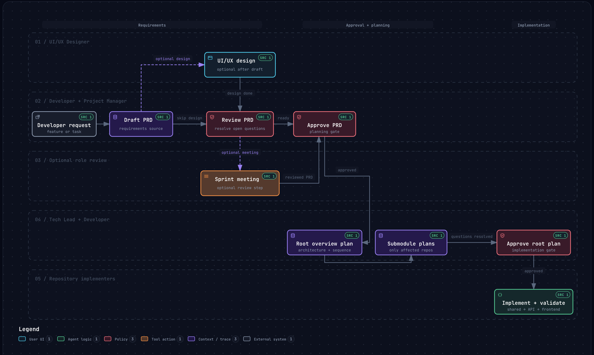

# Agent Workflows

Installable multi-repository coordination workflow for agent-led product work.

This package provides reusable agent rules, skills, command shims,
PRD/plan/research templates, role definitions, workspace integrity checks, and a
local dashboard for browsing Markdown artifacts.



Explore the [interactive workspace delivery workflow](.archify/workflow-workspace-delivery-20260929-093455/workspace-delivery.html).

## Install

Install the package globally when you want the `workflows` command available in
your shell:

```sh
bun add --global @shinnodua/agent-workflows
```

Or install it in a project as a dev dependency:

```sh
bun add --dev @shinnodua/agent-workflows
```

Then initialize the project. Use `workflows` after a global install, or
`bunx workflows` when the package is installed as a project dev dependency:

```sh
bunx workflows init
```

`workflows init` writes local discovery shims into the current project, creates
starter `project/` profile files when they do not exist, and records managed
files in `.agent-workflows/manifest.json`. The shims let source agents discover
commands and skills locally while the source of truth stays in the installed
package.

Restart or reload any active agent session after `workflows init`. Source agents
discover custom agents, commands, and skills from local `.agents/agents/`,
`.codex/prompts/`, `.claude/agents/`, `.claude/skills/`, `.agents/skills/`,
`commands/`, and `workflows.md` shims. Claude Code loads `CLAUDE.md`, which
imports the shared `AGENTS.md` rules. Run `/project-setup` in either agent.

Then fill the project profile with the guided command:

```sh
/project-setup
```

After a PRD exists, run a role-agent review meeting from the active agent chat:

```sh
/sprint-meeting <prd-id>
```

## Commands

```sh
bunx workflows init
project-setup
sprint-meeting
bunx workflows dashboard
bunx workflows update
bunx workflows integrity
bunx workflows check
```

- `workflows init` sets up a developer project to follow the workflow.
- `project-setup` guides the developer through completing the `project/` profile
  files step by step.
- `sprint-meeting` runs a time-boxed role-agent PRD review meeting and saves the
  record under `meeting-logs/`.
- `workflows dashboard` starts the packaged dashboard and reads artifact data
  from the developer project root.
- `workflows update` refreshes workflow-owned shims after upgrading this package.
- `workflows integrity` validates workspace artifact metadata.
- `workflows check` runs package-provided workspace checks.

Package installation leaves existing workspace files unchanged. After upgrading,
run `bunx workflows update` from the project root to refresh the local shims, or
set `AGENT_WORKFLOWS_AUTO_UPDATE=1` during installation to enable that update in
the package lifecycle script. Restart or reload any active agent session after
the refresh.

## Local Shims

Agent Workflows keeps reusable source files in the installed package and writes
small local shims for agent discovery:

- `.agents/skills/*/SKILL.md`
- `.agents/agents/*/agent.md`
- `.codex/prompts/*.md`
- `.claude/skills/*/SKILL.md`
- `.claude/agents/*.md`
- `commands/*.md`
- `AGENTS.md`
- `CLAUDE.md`
- `workflows.md`
- reusable `roles/`, `templates/`, and setup docs

Those shims point back to
`node_modules/@shinnodua/agent-workflows/...` for project-local installs, or to
the actual package install path for global installs. Project-owned files such as
`project/`, `prds/`, `plans/`, `designs/`, `research/`, `meeting-logs/`,
`docs/`, and `modules/` remain local to the consuming workspace.

## Build And Release

Create a changeset for any package change:

```sh
bun run changeset
```

Validate the package before opening a PR:

```sh
bun run package:build
```

GitHub Actions runs CI on pull requests and pushes to `main`. The release
workflow uses Changesets to open a version PR, then publishes after that PR is
merged.

The release workflow publishes to GitHub Packages. The package must stay scoped
as `@shinnodua/agent-workflows`, and repository Actions settings must allow
GitHub Actions to create pull requests. The workflow uses `secrets.GITHUB_TOKEN`
with `packages: write`, so no npm registry token is required.

To install from GitHub Packages, configure the package scope in the consuming
project or user npm config:

```ini
@shinnodua:registry=https://npm.pkg.github.com
```

## Project Setup

After initialization:

1. Edit `project/PROJECT.md` with your product context and ownership boundaries.
2. Edit `project/repositories.json` with your repositories and submodule paths.
3. Add matching Git submodules under `modules/`.
4. Run `bunx workflows integrity` or `bunx workflows check`.
5. Start the dashboard with `bunx workflows dashboard`.

See [docs/workspace-template-setup.md](docs/workspace-template-setup.md) for the
full adaptation checklist.
