# Reusable Workspace Workflows

This document is the readable source for recurring workspace workflows. Keep
`AGENTS.md` focused on repository orientation and durable agent rules; keep
step-by-step workflow behavior here.

## Common Workflow

Install Agent Workflows in the project that should follow this workflow:

```sh
bun add --dev @shinnodua/agent-workflows
```

Initialize workflow files from the project root:

```sh
bunx workflows init
```

Restart or reload any active agent session after initialization so source agents
can discover the local `.agents/agents/`, `.codex/prompts/`, `.agents/skills/`,
`commands/`, and `workflows.md` shims.

Fill the project profile files with guided setup:

```sh
/project-setup
```

When Agent Workflows is upgraded in an initialized project, refresh reusable
workflow files. Package lifecycle scripts run this refresh automatically when
available; run it manually if lifecycle scripts are disabled or
`AGENT_WORKFLOWS_SKIP_AUTO_UPDATE=1` is set:

```sh
bunx workflows update
```

Restart or reload any active agent session after the refresh so it can discover
updated custom agent, command, and skill shims.

Initialized consuming workspaces use a hybrid source model:

- Local files provide agent discovery shims for `.agents/agents/*/agent.md`,
  `.agents/skills/*/SKILL.md`, `.codex/prompts/*.md`, `commands/*.md`,
  `AGENTS.md`, `workflows.md`, reusable `roles/`, `templates/`, and setup docs.
- Packaged files under the installed `@shinnodua/agent-workflows` package remain
  the source of truth for reusable workflow behavior.
- Project-owned files stay local: `project/`, `prds/`, `plans/`, `designs/`,
  `research/`, `meeting-logs/`, `docs/`, `modules/`, and
  `workspace.config.json`.
- `workflows update` refreshes local shims when commands, skills, or reusable
  references are added, removed, or renamed.

Clone an existing initialized workspace with submodules:

```sh
git clone --recurse-submodules <workspace-repo-url>
```

Initialize submodules after a normal clone:

```sh
git submodule update --init --recursive
```

Update submodules to the commits recorded by the workspace:

```sh
git submodule update --recursive
```

Pull latest branches inside each submodule when intentionally refreshing
context:

```sh
git submodule foreach 'git pull --ff-only'
```

Check root and submodule status:

```sh
git status
git submodule status
git submodule foreach 'git status --short'
```

Run the local task-status dashboard against the current project:

```sh
bunx workflows dashboard
```

Validate the local task-status dashboard:

```sh
bun run dashboard:typecheck
bun run dashboard:test
bun run dashboard:build
```

Validate workspace artifact metadata and relationships:

```sh
bunx workflows integrity
```

Run the complete workspace check locally. Lefthook runs this command before
every commit and blocks the commit when any check fails:

```sh
bun run workspace:check
```

The GitHub Actions workflow is manual-only. Run it from the workflow page with
`workflow_dispatch` when remote validation is needed.

This command treats malformed structured metadata and duplicate artifact IDs as
errors. Legacy metadata and references into unavailable submodule worktrees are
reported as warnings during migration.

## Project Profile

Project-specific repository data lives in `project/` so this workspace can be
reused for other multi-repository projects.

- `project/PROJECT.md` describes the current project and ownership boundaries.
- `project/repositories.json` is the source of truth for submodule IDs, paths,
  purposes, agent guide paths, artifact directories, code scan directories, and
  validation commands.
- `project/validation.json` stores workspace-local validation command groups.
- `project/workflows.json` can describe project-specific implementation stages.

When applying the workspace to a new project, replace `project/` and
`.gitmodules`, then run `bun run workspace:check`. See
[`docs/workspace-template-setup.md`](docs/workspace-template-setup.md).

## PRD And Planning Workflow

Every feature or implementation task must start with a saved PRD before planning
or code changes begin. The PRD is the source of truth for user requirements.

### Role-Aware Workflow Diagram

Use this diagram as the workspace overview for feature and implementation work.
It shows the normal artifact flow, the role that owns each step, and where work
hands off between planning, design, and repository-specific implementation.

```mermaid
flowchart LR
  request([Developer request])

  subgraph pm [Project Manager]
    prd[Create draft PRD]
    clarifyPrd{PRD needs clarification?}
    updatePrd[Update PRD from answers]
    needsDesign{Requires UI/UX design?}
    approvePrd[Approve PRD]
  end

  subgraph designer [UI/UX Designer]
    design[Create design artifact]
    designDone[Update PRD status to design-done]
  end

  subgraph tl [Tech Lead]
    research[Optional research brief]
    rootPlan[Create root overview plan]
    subPlans[Delegate affected submodule plans]
    clarifyPlan{Plan needs clarification?}
    updatePlan[Update plan from answers]
    approvePlan[Approve root plan]
  end

  subgraph core [Shared/Core Developer]
    coreImpl[Implement shared contracts, design system, or core logic]
    coreValidate[Validate shared/core repositories]
  end

  subgraph service [Backend Developer]
    apiImpl[Implement backend API or service changes]
    apiValidate[Validate backend repositories]
  end

  subgraph web [Frontend Developer]
    webImpl[Implement web frontend changes]
    webValidate[Validate web frontend repositories]
  end

  subgraph app [Frontend Developer]
    appImpl[Implement app frontend changes]
    appValidate[Validate app frontend repositories]
  end

  frontendReady((Frontend stage ready))
  frontendDone((Frontend stage complete))

  finish([Report changed repos, validation, and submodule pointer status])

  request --> research
  request --> prd
  research --> prd
  prd --> clarifyPrd
  clarifyPrd -->|Yes| updatePrd --> clarifyPrd
  clarifyPrd -->|No| needsDesign
  needsDesign -->|Yes - status: need-design| design
  design --> designDone --> approvePrd
  needsDesign -->|No| approvePrd
  approvePrd -->|Status: approved| rootPlan
  rootPlan --> subPlans --> clarifyPlan
  clarifyPlan -->|Yes| updatePlan --> clarifyPlan
  clarifyPlan -->|No| approvePlan
  approvePlan --> coreImpl --> coreValidate
  coreValidate --> apiImpl --> apiValidate
  apiValidate --> frontendReady
  frontendReady --> webImpl --> webValidate --> frontendDone
  frontendReady --> appImpl --> appValidate --> frontendDone
  frontendDone --> finish
```



### Role Responsibilities By Step

| Step | Primary role | Supporting roles | Artifact or output |
| --- | --- | --- | --- |
| Developer request | Developer | Project Manager, Tech Lead | Initial scope, constraints, and explicit exceptions to the normal workflow |
| Optional research brief | Tech Lead + Project Manager | UI/UX Designer when experience research is needed | `research/RESEARCH-*.md` |
| Draft PRD | Project Manager | Developer | `prds/PRD-*.md` with user value, scope, requirements, and acceptance criteria (status: `draft`) |
| PRD clarification | Project Manager | Developer | Updated PRD with resolved ambiguity |
| PRD approval / design routing | Developer | Project Manager | If design needed: PRD status `need-design`. If ready for planning (from `draft` or `design-done`): PRD status `approved` |
| Design artifact | UI/UX Designer | Project Manager, Tech Lead | Open Design artifact or Markdown design spec, PRD design backlink, and PRD status updated to `design-done` |
| Root overview plan | Tech Lead | Project Manager, UI/UX Designer | `plans/PLAN-*.md` with architecture, ownership, sequence, validation, and risks |
| Submodule detail plans | Tech Lead via sub-agents | Core, Backend, Frontend roles | `modules/*/plans/*.md` for only affected repositories |
| Plan clarification | Tech Lead | Developer, implementation roles | Updated root or submodule plan |
| Plan approval | Developer | Tech Lead | Approved root plan that permits implementation |
| Shared/core implementation | Core Developer | Tech Lead | Changes in repositories tagged as shared, core, package, or design-system owners in `project/repositories.json` |
| Backend/API implementation | Backend Developer | Tech Lead, Core Developer | API/backend changes in repositories tagged as backend or service owners in `project/repositories.json` |
| Web frontend implementation | Frontend Developer | UI/UX Designer, Backend Developer | Web frontend changes in repositories tagged as web/frontend owners; may run in parallel with app frontend implementation when contracts are ready |
| App frontend implementation | Frontend Developer | UI/UX Designer, Backend Developer, Core Developer | App frontend changes in repositories tagged as app/frontend owners; may run in parallel with web frontend implementation when contracts are ready |
| Validation and handoff report | Implementing role for each repo | Tech Lead | Validation results, changed submodules, and root submodule pointer note |

### PRD Commands

Detailed workflow behavior lives in project skills under `.agents/skills/`.
Command files under `commands/` are compatibility shims that point to the
corresponding skill. Codex custom slash commands live in `.codex/prompts/` and
should only delegate to the corresponding skill with `$ARGUMENTS`.

- `$project-setup`, `project-setup`, or `/project-setup`
  - Skill: `.agents/skills/project-setup/SKILL.md`.
  - Codex slash prompt: `.codex/prompts/project-setup.md`.
  - Command spec: `commands/project-setup.md`.
  - Guide the developer step by step through completing `project/PROJECT.md`,
    `project/repositories.json`, `project/validation.json`,
    `project/workflows.json`, and `.gitmodules`.
  - Read existing project setup files first, preserve developer-provided values,
    ask one setup question at a time, and update files incrementally.
  - Do not clone repositories, initialize submodules, install packages, push, or
    edit product code unless the developer explicitly asks for that separately.
- `$create-prd <description>`, `create-prd <description>`, or `/create-prd <description>`
  - Skill: `.agents/skills/create-prd/SKILL.md`.
  - Codex slash prompt: `.codex/prompts/create-prd.md`.
  - Command spec: `commands/create-prd.md`.
  - Analyze `<description>` and create a PRD from `templates/prd-template.md`.
  - Include any directly relevant saved research in the PRD research-source
    metadata and research context.
  - Store PRDs in `prds/`.
  - Give every PRD a stable `PRD ID`.
  - Set initial PRD status to `draft`.
  - Do not create implementation plans or edit code until the PRD is approved.
- `$griling-prd <prd-id-or-path>`, `griling-prd <prd-id-or-path>`, or `/griling-prd <prd-id-or-path>`
  - Skill: `.agents/skills/griling-prd/SKILL.md`.
  - Codex slash prompt: `.codex/prompts/griling-prd.md`.
  - Command spec: `commands/griling-prd.md`.
  - Review an existing PRD for unclear, missing, conflicting, or risky requirements.
  - Ask the developer clarifying questions before changing the PRD.
  - After the developer answers, update the PRD according to those answers.
  - Do not create implementation plans or edit code until the PRD is approved.
- `$sprint-meeting <prd-id>`, `sprint-meeting <prd-id>`, or `/sprint-meeting <prd-id>`
  - Skill: `.agents/skills/sprint-meeting/SKILL.md`.
  - Codex slash prompt: `.codex/prompts/sprint-meeting.md`.
  - Command spec: `commands/sprint-meeting.md`.
  - Run a visible, time-boxed PRD review meeting with all workspace role
    sub-agents: Project Manager, Tech Lead, UI/UX Designer, Backend Developer,
    and Frontend Developer.
  - Require every sub-agent to read the PRD and related documents before
    discussing requirements, risks, unanswered questions, and PRD improvements.
  - Keep active agent discussion to 5 minutes or less, excluding time spent
    waiting for developer answers.
  - Show meeting progress, agent findings, and human-only questions in the
    developer's active chat window.
  - Assign every question to the role agents that can answer it or to
    `@developer` when human input is required.
  - Update the PRD after the meeting and save the question-and-answer record
    under `meeting-logs/` with a filename based on the PRD ID.
  - Do not approve the PRD, create plans, or edit product code.
- `$approve-prd <prd-id>`, `approve-prd <prd-id>`, or `/approve-prd <prd-id>`
  - Skill: `.agents/skills/approve-prd/SKILL.md`.
  - Codex slash prompt: `.codex/prompts/approve-prd.md`.
  - Command spec: `commands/approve-prd.md`.
  - If the PRD contains open questions, automatically invoke the `griling-prd` skill to require the developer to answer all open questions before proceeding.
  - If the PRD status is `draft`, ask the developer whether to move to UI/UX design (`$create-design`) or proceed directly to create plans.
  - If design is selected, update the PRD status to `need-design` and instruct the developer to run `$create-design`.
  - If planning is selected or if the PRD is already in `design-done` status, mark the PRD status as `approved` and set approval metadata.
  - After approval, automatically create the root overview plan and any required submodule plans using `templates/plan-template.md`.
  - Plans created from an approved PRD must link back to that PRD.
  - Plans must carry forward relevant PRD research sources and summarize the
    planning implications for the root plan and each affected submodule plan.
- `$approve-plan <plan-id>`, `approve-plan <plan-id>`, or `/approve-plan <plan-id>`
  - Skill: `.agents/skills/approve-plan/SKILL.md`.
  - Codex slash prompt: `.codex/prompts/approve-plan.md`.
  - Command spec: `commands/approve-plan.md`.
  - If the root plan or linked submodule plans contain open questions, automatically invoke the `griling-plan` skill to require the developer to answer all open questions before approving the plan.
  - Mark the matching root plan status as `approved`.
  - Implementation may begin only after the root plan is approved.
  - Reassess dependency-safe implementation stages after each completed stage.
    When multiple frontend repositories are ready and do not depend on each
    other's unimplemented local changes, spawn one frontend sub-agent for each
    platform and implement them in parallel.
- `$griling-plan <plan-id-or-path>`, `griling-plan <plan-id-or-path>`, or `/griling-plan <plan-id-or-path>`
  - Alias: `$grilling-plan <plan-id-or-path>`, `grilling-plan <plan-id-or-path>`, or `/grilling-plan <plan-id-or-path>`.
  - Skill: `.agents/skills/griling-plan/SKILL.md`.
  - Codex slash prompt: `.codex/prompts/griling-plan.md`.
  - Alias slash prompt: `.codex/prompts/grilling-plan.md`.
  - Command spec: `commands/griling-plan.md`.
  - Review an existing root overview plan or submodule plan for unclear,
    missing, conflicting, or risky implementation decisions.
  - Ask the developer clarifying questions before changing the plan.
  - After the developer answers, update the plan according to those answers.
  - Do not approve the plan or edit product code.

### Research Command

- `$research <description>`, `research <description>`, or `/research <description>`
  - Skill: `.agents/skills/research/SKILL.md`.
  - Codex slash prompt: `.codex/prompts/research.md`.
  - Command spec: `commands/research.md`.
  - Research `<description>` from both project-manager and tech-lead
    perspectives.
  - Create a structured research brief from `templates/research-template.md`.
  - Store research briefs in `research/`.
  - Use saved research to improve future PRDs, root overview plans, and
    submodule plans.
  - Do not create PRDs, plans, or edit product code unless the developer
    explicitly asks for that as a separate step.

### Create Design Command

- `$create-design <design request>`, `create-design <design request>`, or
  `/create-design <design request>`
  - Skill: `.agents/skills/create-design/SKILL.md`.
  - Codex slash prompt: `.codex/prompts/create-design.md`.
  - Command spec: `commands/create-design.md`.
  - Read and adopt `roles/ui-ux-designer.md` before doing design work.
  - Use Open Design when available to create or refine UI/UX design artifacts.
  - Produce implementation-ready flows, screen specs, component states,
    responsive behavior, accessibility guidance, and open questions.
  - Link design artifacts in the PRD `## Design Artifacts` section and update
    the PRD status to `design-done`.
  - After design is done, the developer can run `$approve-prd <prd-id>` to approve
    the PRD and advance to the planning phase.
  - Do not edit product code unless the developer explicitly asks for
    implementation and the approved workflow allows it.

### Diagram Command

- `$create-diagram <diagram request>`, `create-diagram <diagram request>`, or
  `/create-diagram <diagram request>`
  - Skill: `.agents/skills/create-diagram/SKILL.md`.
  - Codex slash prompt: `.codex/prompts/create-diagram.md`.
  - Command spec: `commands/create-diagram.md`.
  - Create or improve Markdown-friendly workflow diagrams, architecture
    diagrams, role handoff diagrams, and process maps.
  - Prefer Mermaid for repo documentation. Use role-oriented subgraphs or
    swimlane-style layouts when ownership and handoffs matter.
  - Include the roles involved in each major step when the diagram represents a
    workflow or operational process.
  - Validate diagram syntax and readability before finishing whenever practical.

### Custom Command Pattern

When adding a project custom command:

1. Create `.agents/skills/<command-name>/SKILL.md` with the full workflow behavior.
2. Optionally create `.agents/skills/<command-name>/agents/openai.yaml` for Codex UI metadata.
3. Create `.codex/prompts/<command-name>.md` as a minimal slash-command shim. It should delegate to the skill and pass `$ARGUMENTS`.
4. Create `commands/<command-name>.md` as a minimal human-readable compatibility shim that points to the skill.
5. Keep workflow behavior in the skill, not duplicated across prompt or command shims.

### Plan Rules

- Store root-level overview plans in `plans/`.
- Use one plan file per feature, task, or initiative.
- Give every root overview plan a stable `Plan ID`.
- The root plan should describe the overall goal, approved PRD link, research
  sources, cross-repo architecture, affected submodules, sequencing,
  integration points, validation approach, and open questions.
- When a task requires work inside a submodule, create a matching detailed plan in that submodule's `plans/` directory.
- Submodule plans must be created by spawned sub-agents. The master agent owns the root overview plan, then gives each sub-agent the approved PRD, draft root plan, platform responsibility, cross-repo dependencies, validation expectations, risks, open questions, target plan path, and required parent-plan link.
- Each submodule planning sub-agent must read and follow the affected
  repository's `agentGuide` from `project/repositories.json` before writing its
  plan.
- Create submodule plans only for submodules affected by the current task.
- Link each submodule plan from the root overview plan and include a short summary of that submodule's responsibility.
- Submodule plans must be detailed enough to implement the feature in that platform, including research sources and platform-specific implications, implementation steps, files or areas to inspect, expected code changes, validation commands, risks, and dependencies on other submodules.
- Keep PRDs and plans updated when scope changes during implementation.
- Do not begin code edits until the PRD is approved, the root overview plan exists, any required submodule plans exist, and the root plan is approved.

### Dashboard Structure

- Keep the root task-status dashboard in `dashboard/`.
- Keep `dashboard/src/App.tsx` as a thin app shell; feature implementation should live under `dashboard/src/features/task-status/`.
- Keep task-status components under `dashboard/src/features/task-status/components/`.
- Keep task-status parsing, grouping, status, and Markdown-link utilities under `dashboard/src/features/task-status/utils/`.
- Keep focused dashboard tests beside the feature utilities under `dashboard/src/features/task-status/utils/test/`.
- Keep all `dashboard/**/*.ts` and `dashboard/**/*.tsx` files under 350 lines
  when practical, matching the frontend conventions used by this workspace.
- Use the shared design system identified by `project/repositories.json`; do not
  duplicate shared UI primitives in the dashboard.
- Dashboard artifact discovery reads root artifact directories from
  `workspace.config.json` and submodule artifact directories from
  `project/repositories.json`.
- Do not commit generated dashboard outputs such as `dashboard/dist/` or dependencies such as `dashboard/node_modules/`.

### Implementation Sequence

After `$approve-plan <plan-id>`, `approve-plan <plan-id>`, or
`/approve-plan <plan-id>`, implement code by dependency-safe stages:

1. Shared/core stage from `project/workflows.json`, when affected
2. Backend/API stage from `project/workflows.json`, when affected
3. Frontend stage:
   - Web frontend repositories from `project/repositories.json`, when affected
   - App frontend repositories from `project/repositories.json`, when affected

Skip any platform that is missing from the approved plan.

After core and API work are implemented and validated, reassess whether the
frontend stage can run in parallel. If both frontend platforms are present in
the approved plan, their required shared contracts and APIs are already
available locally, and neither frontend depends on the other's unimplemented
changes, spawn one implementation sub-agent for each ready frontend platform.
Give each sub-agent only its platform plan, relevant root-plan context,
dependency notes, validation commands, and the frontend role instructions.

If either frontend platform still depends on another platform's unimplemented
local changes, implement the blocked dependency first and reassess parallel
safety before continuing.

When implementing API or backend service work, first read and adopt
`roles/backend-developer.md`. In that role, modify only backend/API files within
the current backend repository, rely on shared contracts from the configured
shared/core repositories, and do not redefine shared types, interfaces, or
validation schemas in the service.

When implementing web or app frontend work, first read and adopt
`roles/frontend-developer.md`. In that role, modify only frontend files within
the current frontend repository, rely on shared contracts from
the configured shared/core repositories, and do not redefine shared types,
interfaces, or validation schemas in frontend code.

After finishing one dependency stage, stop and ask the developer whether to
continue to the next stage or stop. If continuing and the next stage depends on
newly changed local packages or APIs, ask whether to link local packages/use
local code or depend on deployed/published packages or services.

The developer owns commits. Agents must not automatically commit code or
workflow changes for any task.
